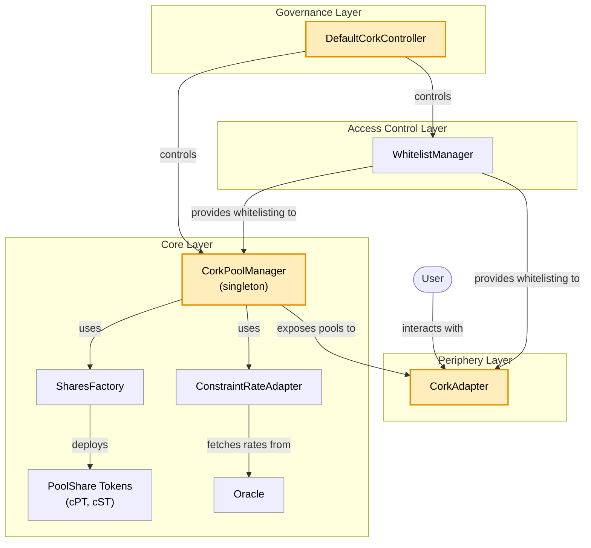

# Cork Phoenix 

Cork is a programmable risk layer for on-chain assets such as vault tokens, yield-bearing stablecoins, and liquid (re)staking tokens.

## Table of Contents

- [Glossary](#glossary)
- [Architecture](#architecture)
- [Smart Contracts](#smart-contracts)
- [Deployment Addresses](#deployment-addresses)
- [Setup](#setup)
- [Testing](#testing)
- [Standards & Frameworks](#standards--frameworks)
- [Audits](#audits)
- [Security](#security)
- [License](#license)
- [Resources](#resources)
- [Inspirations & Sources](#inspirations--sources)
- [Useful Links](#useful-links)

## Glossary

- CA = Collateral Asset,
- REF = Reference Asset,
- cPT = Cork Principal Token,
- cST = Cork Swap Token

## Architecture

Cork Phoenix uses a singleton-style architecture where all pool states are managed by [`CorkPoolManager.sol`](./contracts/core/CorkPoolManager.sol). This design enables efficient and secure state management of the system and providing a single source of truth for all Cork Phoenix markets.

### Core Operations

Cork Phoenix provides a comprehensive set of operations for managing positions throughout their lifecycle. All operations are available in [`CorkPoolManager.sol`](./contracts/core/CorkPoolManager.sol).

#### Before Expiry

| Operation | Description | Input Tokens | Output Tokens | Pool Assets |
|-----------|-------------|--------------|---------------|-------------|
| **Deposit / Mint** | Enter a liquidity position to the protocol to receive a swap token. | CA | cPT + cST | CA ↑ |
| **UnwindDeposit / UnwindMint** | Exit a liquidity position, before expiry, to recoup the deposited collateral. | cPT + cST | CA | CA ↓ |
| **Swap / Exercise** | Exercise your coverage to get collateral. | REF + cST | CA - Fee | CA ↓ REF ↑ cST ↑ |
| **UnwindSwap / UnwindExercise** | Purchase previously exercised swap tokens back from the protocol by providing collateral asset. | CA + Fee | REF + cST | CA ↑ REF ↓ cST ↓ |

#### After Expiry

| Operation | Description | Input Tokens | Output Tokens | Pool Assets |
|-----------|-------------|--------------|---------------|-------------|
| **Withdraw / Redeem** | Exit a liquidity position, after expiry, to recoup the deposited collateral. | cPT | CA + REF | CA ↓, REF ↓ |

### Dual Share System

Each pool issues _two_ shares upon deposit: **cPT (Cork Principal Token) and cST (Cork Swap Token)**. This enables users to hold or trade principal and swap exposures separately.

### System Components



### Periphery

It's important to note that while you can interact with `CorkPoolManager` directly, it does not provide slippage and deadline protection out of the box. If slippage is a concern, consider using our periphery adapter ([`CorkAdapter.sol`](./contracts/periphery/CorkAdapter.sol)). This contract is inspired by the Morpho [`GeneralAdapter1`](https://github.com/morpho-org/bundler3/blob/main/src/adapters/GeneralAdapter1.sol) contract. You can use the adapter with the [`bundler3`](https://github.com/morpho-org/bundler3/blob/main/README.md) contract similar to how you would normally use the Morpho adapter with multicall, but tailored specifically to Cork's adapter.

## Smart Contracts

### Core Contracts

| Contract | Role | Key Responsibilities |
|----------|------|---------------------|
| **CorkPoolManager** | Singleton pool management | Pool creation, deposits/mints, withdrawals/redemptions, swaps/exercise, and their unwind operations |
| **DefaultCorkController** | Protocol governance & administration | Pool authorization, fee management, pause controls, whitelist access management, treasury operations |
| **WhitelistManager** | Access control management | Global and market-specific whitelisting mechanism |
| **ConstraintRateAdapter** | Rate protection & oracle safety | Rate clamping with configurable constraints, protection against oracle manipulation and extreme volatility |
| **PoolShare** | Token implementation | ERC20 tokens (cPT & cST) with EIP-2612 permit support, burnable functionality, and ERC4626 compatibility |
| **SharesFactory** | Token deployment | Deploys cPT and cST token pairs per market with consistent configuration |
| **CorkPoolManagerStorage** | State management | Defines protocol state structures and storage layout |


### Periphery Contracts

| Contract | Role | Key Features |
|----------|------|--------------|
| **CorkAdapter** | Bundler3 integration with user protection | Safe operations with slippage protection, deadline checks, minimum output enforcement, and whitelist validation. Provides protected versions of all core operations (mint, deposit, withdraw, swap, exercise, redeem, and unwinds). |
| **WrapperRateConsumer** | Rate oracle wrapper | Wraps MorphoChainlinkOracleV2 to provide normalized exchange rates between base and quote tokens with decimal adjustment |

### Interfaces

All interfaces are located in [this folder](contracts/interfaces/)

## Deployment Addresses

Cork Protocol uses the [Safe CREATE2 Deployer](https://github.com/safe-global/safe-singleton-factory) to ensure consistent contract addresses across all chains.

### Deployed on following networks

- Ethereum Mainnet (chain ID: 1)

### Protocol Contracts

All core Cork contracts share the same addresses across all deployed chains:

| Contract | Address |
|----------|---------|
| CorkPoolManager | `TBD` |
| WhitelistManager | `TBD` |
| ConstraintRateAdapter | `TBD` |
| SharesFactory | `TBD` |
| DefaultCorkController | `TBD` |
| CorkAdapter | `TBD` |

### External Dependencies

| Contract | Address |
|----------|:-------:|
| Permit2  | `0x000000000022D473030F116dDEE9F6B43aC78BA3` |
| Morpho Bundler3 | See [Morpho Addresses](https://docs.morpho.org/get-started/resources/addresses/#bundlers) |

> **Note**: For Sepolia testnet, Bundler3 is deployed at `0xd43EB38E260bF2d6c9B3222559842686B1C303C0`

For deployment parameters and configuration, see [config/prod.toml](config/prod.toml).

For WrapperRateConsumer oracle deployments, see[config/markets/README.md](config/markets/README.md).

## Setup

For detailed setup, build, and test instructions, see [USAGE.md](USAGE.md).

## Testing

Cork Phoenix employs a comprehensive multi-layered testing approach to ensure protocol security and correctness.

### Test Structure

```
test/forge/
├── unit/          # Isolated tests for libraries and individual contracts
├── integration/   # End-to-end workflow tests across multiple contracts
├── smoke/         # Tests contract functions against on-chain data
├── helpers/       # Test helper contracts
└── mocks/         # Mock contracts for testing
```

- **Unit Tests**: Isolated testing of libraries and individual contract functions
- **Integration Tests**: End-to-end workflows testing interactions between multiple contracts
- **Fuzz Tests**: Property-based testing using Foundry's fuzzing engine for edge cases, decimals, and rounding
- **Smoke Tests**: Contract function validation against on-chain data

## Standards & Frameworks

### OpenZeppelin Contracts

Cork Phoenix builds on OpenZeppelin's battle-tested security standards to ensure robust access control, upgradeability, and protection against common attack vectors. We implement **ERC-7201** namespaced storage layout for future-proof upgradeable contracts and use the UUPS proxy pattern for gas-efficient upgrades while maintaining security through role-based access control.

### ERC4626 Tokenized Vault Standard

While Cork implements ERC4626-compatible interfaces for familiarity, we extend beyond the standard with a **dual token system** (cPT + cST) that separates principal protection from swap exposure. This architectural choice enables users to independently hold or trade their cPT and cST tokens, a key differentiator from traditional single-share vault designs.

### Morpho Bundler3

Cork integrates Morpho's bundler3 framework to enable **atomic multi-operation transactions**. This allows users to compose complex workflows (e.g., deposit + swap + exercise) in a single transaction, significantly improving UX and reducing gas costs. Our `CorkAdapter.sol` extends Morpho's `GeneralAdapter1` with Cork-specific safety checks including slippage protection and deadline enforcement.

### Uniswap Permit2

We leverage Permit2 for **signature-based token approvals**, eliminating the need for separate approval transactions. This reduces friction for users and enables gas-efficient batch operations—critical for a protocol where users frequently interact with multiple tokens (REF, CA, cPT, cST) across different operations.

## Audits

All audit reports are stored in the [audits](audits/) folder.

## Security

For security policies and vulnerability disclosure see [SECURITY.md](SECURITY.md).

## License

See the [LICENSE](LICENSE) file for details. Individual contracts may have specific license specifications.

## Resources

Find a complete development guide at [USAGE.md](USAGE.md)

## Inspirations & Sources

**Morpho Bundler3** ([GitHub](https://github.com/morpho-org/bundler3))
- Transaction batching framework for atomic multi-step operations
- Source: `GeneralAdapter1.sol` adapted from Morpho's bundler3
- Purpose: Gas optimization and improved UX through operation bundling

**Uniswap Permit2** ([GitHub](https://github.com/Uniswap/permit2))
- Signature-based approvals for gas-efficient token transfers
- Batch approval capabilities
- Integration in periphery adapters

**OpenZeppelin Contracts**
- Security patterns: AccessControl, Pausable, ReentrancyGuard
- Upgradeable proxy infrastructure: UUPS, ERC1967Proxy
- Token standards: ERC20, ERC20Permit (EIP-2612)
- Libraries: Math, SafeERC20, SafeCast

**Chainlink Oracles**
- `MinimalAggregatorV3Interface` inspired by Chainlink's AggregatorV3Interface
- Price feed integration for external rate data

**ERC4626 Tokenized Vault Standard**
- Partial compatibility for deposit/withdraw/redeem operations
- Deviation: Dual token system instead of single share token
- Additional swap/exercise functionality beyond ERC4626 scope

## Useful Links

- [Cork Documentation](https://docs.cork.tech/)
- [Cork Phoenix Litepaper](https://corkfi.notion.site/cork-litepaper)